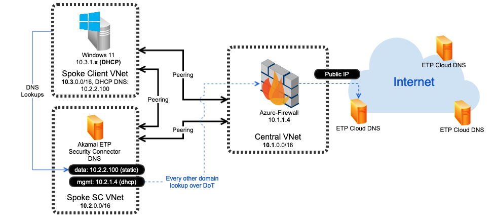

# Akamai SIA Cloud Security Connector with Azure Firewall<!-- omit in toc -->

## About this document

This document walk through the build of a lab showing how you can protect your workload in Azure from DNS threats with Akamai Secure Internet Access. 

Through a tight integration with Azure Firewall, you will be able to block threat directly at the DNS level.

Last update: January 2023, 27th

Authors:
- Antoine Drochon (androcho@akamai.com)
- Mike Schiessl (mschiessl@akamai.com)

## Table of contents<!-- omit in toc -->

- [About this document](#about-this-document)
- [Prerequisites](#prerequisites)
- [Target architecture](#target-architecture)
- [Deploying the Akamai Security Connector + Azure Firewall demo](#deploying-the-akamai-security-connector--azure-firewall-demo)
  - [Terraform for the heavy lifting](#terraform-for-the-heavy-lifting)
  - [Configure your SIA Enterprise Security Connector](#configure-your-sia-enterprise-security-connector)
    - [Declare/Activate the Security Connector](#declareactivate-the-security-connector)
    - [Create a SIA Location and Policy](#create-a-sia-location-and-policy)
  - [Test!](#test)
- [Demo from within the environment](#demo-from-within-the-environment)

## Prerequisites

- Microsoft [Azure Account](https://azure.microsoft.com) with an empty Resource Group
- Akamai SIA Enterprise (formerly ETP) account ([free trial]([#](https://www.akamai.com/products/secure-internet-access-enterprise)))
- A computer with Azure CLI `az` and Terraform
- A Remote Desktop Client

## Target architecture



## Deploying the Akamai Security Connector + Azure Firewall demo

### Terraform for the heavy lifting

It takes between 5 and 10 minutes to fully populate a Resource Group.
See https://techdocs.akamai.com/etp/docs/deploy-security-connector#deploy-security-connector-on-microsoft-azure for the step by step process if you decide to go manually.

```bash
# Customize to your own Terraform variables
# Use variable-files/example-variables.tf as a template
MYTFVAR="../variable-files/androcho-jan23-demo.tf"

# Terraform standard commands
terraform init
terraform plan -var-file=$MYTFVAR
terraform apply -var-file=$MYTFVAR

# Display the public IP address you need to connect to
# to access the Windows Client machine over RDP
terraform output

# And once the demo is over
terraform destroy -var-file=$MYTFVAR
```

### Configure your SIA Enterprise Security Connector

#### Register the Security Connector

- Follow [Add Security Connector instructions](https://techdocs.akamai.com/etp/docs/add-security-connector)
- Write down the [Activation Code](https://techdocs.akamai.com/etp/docs/generate-activation-code1)
- SSH to Security Connector Console
  - Use `<AZFirewall_Public_IP>:30002` if remote
  - or from the Windows machine within the lab `<Security Connector Mgmt IP>:22`
  - Follow instructions on screen to activate
- By default the Gateway IP will be correct on the `en2` network interface, but missing on the `en1` network interface. Set en1 to Static instead of DHCP, IP should be `10.2.2.100`, mask (`255.255.255.0`) and set the gateway to `10.2.2.1`

Once the setup complete, you should see something like the screenshot below:


#### Create a SIA Location and Policy

- Open Akamai Control Center https://control.akamai.com
- Navigate to **Enterprise Center**
- On the left menu open **Threat Protector** > **Policy**
- Add a new policy in `DNS-only` mode
- Save the policy with your prefered name
- On the left menu choose **Threat Protector** > **Locations**
- Add a new location with the public IP address of the Azure Firewall
- Set the policy to the one your previously created

### Test!

On the Windows machine, open a CMD Shell:

```cmd
C:\Users\akamai> nslookup
> www.akamai.com <Security Connector Data IP>
``` 
It should return the nearest Akamai Server

Now let's try with a bad domain. More test URLs at  
https://techdocs.akamai.com/etp/docs/test-security-connector

```cmd
> akamaietpphishingtest.com
```

## Demo from within the environment

1. Connect to the Windows Client with your RDP client
    - RDP machine: `<AZFirewall_Public_IP>:30001`
    - Username: `akamai`
    - Password: `<As defined in your $MYTFVAR>`
2. Open Microsoft Edge
  - Open the following URLs:
    - http://akamaietpphishingtest.com
    - http://akamaietpcnctest.com
    - http://akamaietpmalwaretest.com

# Limitations / known issues

## Azure Firewall slow to create

**Problem**: The creation of the Azure Firewall takes a few minutes, we observed around 6 minutes  
**Solution**: it should not time out, be patient

## Security Connector failure to provision

**Problem**:
```
│ Error: waiting for creation of Linux Virtual Machine: (Name "Ak-SIA-SC-instance" / Resource Group "your-resource-group"): Code="OSProvisioningTimedOut" Message="OS Provisioning for VM 'Ak-SIA-SC-instance' did not finish in the allotted time. The VM may still finish provisioning successfully. Please check provisioning state later. Also, make sure the image has been properly prepared (generalized).\r\n * Instructions for Windows: https://azure.microsoft.com/documentation/articles/virtual-machines-windows-upload-image/ \r\n * Instructions for Linux: https://azure.microsoft.com/documentation/articles/virtual-machines-linux-capture-image/ \r\n * If you are deploying more than 20 Virtual Machines concurrently, consider moving your custom image to shared image gallery. Please refer to https://aka.ms/movetosig for the same."
```

**Solution**:
- Replace "Standard_B2s" by "Standard_F2s_v2" in `terraform-scripts/modules/aksia/instance.tf`.
- If that's possible, try a different Azure location